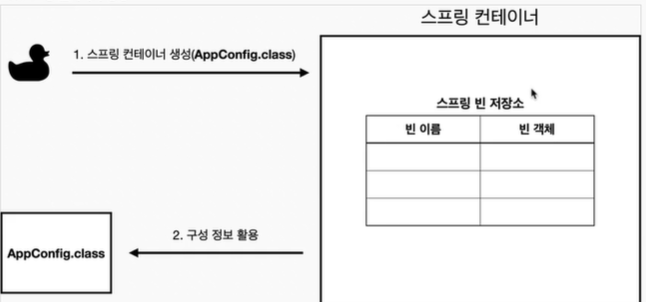
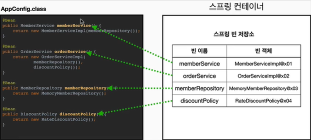
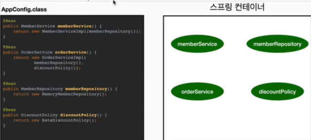

## 스프링 컨테이너 생성과정

1. 스프링 컨테이너 생성

    

   - `new AnnotationConfigApplicationContext(AppConfig.class)`
   - 컨텍스트에 AppConfig 를 지정해서 구성 정보를 넣어줘야한다.

2. 스프링 빈 등록

   

   - 스프링 컨테이너는 파라미터로 넘어온 설정 클래스 정보를 스프링 빈에 등록한다.
   - 이 때, 빈 이름은 AppConfig에서 사용된 메서드 이름을 사용한다.
   - 빈 이름을 직접 부여도 가능하다.
    `@Bean(name=”memberService2”)` 

   - 빈 이름은 동일한 이름 사용불가!

3. 스프링 빈 의존관계 설정 - 준비

   

4. 스프링 빈 의존관계 설정 - 완료

   

   - 스프링 컨테이너는 설정 정보를 참고해서 의존관계를 주입(DI)한다.
      - 여기서 DI를 하는구만!

- 정리를 하자면
   1. 스프링 컨테이너를 생성하고
   2. 빈을 등록하고
   3. 빈끼리 의존관계를 주입(DI)해준다.